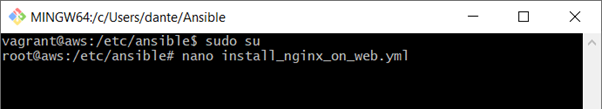
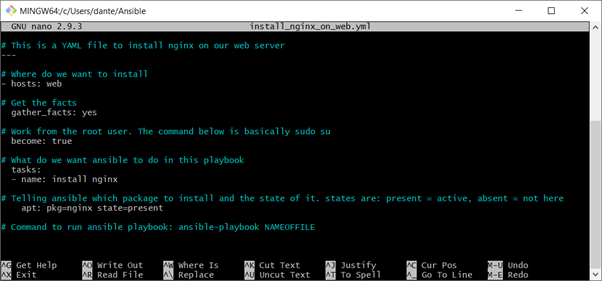
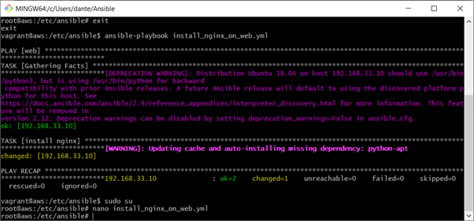
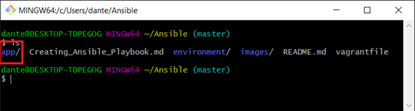
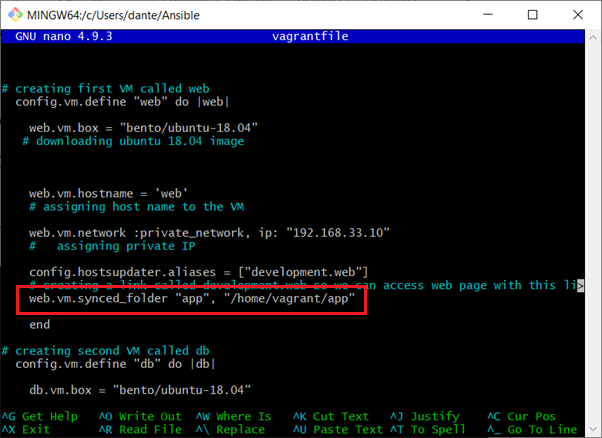
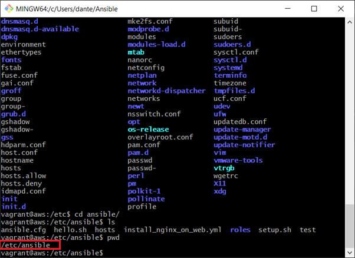
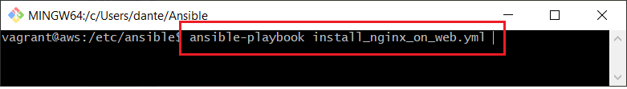
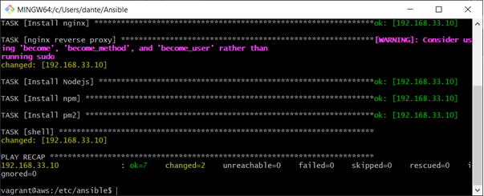
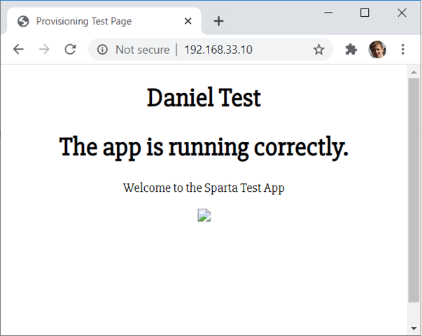

# Creating Ansible Playbook
## Adhog commands
- ansible all -m shell -a "ifconfig" finding ip address
- ansible all -m shell -a "env" # find environment variables
- ansible all -a "uptime" # checking uptime for all machines
- ansible all -a "df -h" # Checking disk space for all machines 
- ansible all -a "mpstat -P all" # Checking all processes for all machines

## Checking the syntax on your playbook.
To check the syntax of your playbook you can use the command:
```python
ansible-playbook install_nginx_on_web.yml --check
```
## What are they?
- Automates to tasks in multiple servers
- Playbooks are written in YMAL .ymal or .yml extention. YAML Syntax – YAML file starts with --- three dashes (---)

## Why should we use them/benefits?
For configuration management – install programs – update programs – etc..

## How to create a playbook?

## What can we do with playbooks?
- Configuration management

## If we have adhog commands why do we need to use playbooks?
- Because in 1 playbook we can install nginx on 50 servers


##### 1) In your controller go into the root using ```sudo su``` and then create the filename with the .yml or ymal file extention



##### 2) Syntax to install nginx is seen below. It will install nginx on the web as seen in the hosts.



##### 3) Then save the file and leave the root using the exit command. Once out of the root use the command 
``` ansible-playbook install_nginx_on_web.yml ```



## Getting the app running using Ansible

##### 1) First move over the app file from a previous repo. As you can see I have the app folder inside my Ansible Dirc



##### 2) Next you want to edit the vagrant file to sync that specific app folder. Remember to add it to the web VM. The code is seen below:
```python
web.vm.synced_folder "app", "/home/vagrant/app"
```


##### 3) Now if you VMs are already up and running use the command
```python
vagrant reload
```
##### Or if they are not up and running just use
```python
vagrant up
```

##### 4) Now ssh inside of the AWS machine using ```vagrant ssh aws```. I will be using this VM as the controller. Once inside navigate to etc/ansible as seen below.



##### 5) Once at etc/ansible you create a playbook using ```sudo nano PLAYBOOKNAME.yml``` Remember the file extention of yml. My playbook can be seen below

```python
# This is a YAML file to install nginx onto oue web VM using YAML
---

# where do we want to install
- hosts: web

# get the facts
  gather_facts: yes

# changes access to root user
  become: true

# what do we want ansible to do for us in the playbook
# In this case our only task is to install nginx

  tasks:
  - name: Install nginx
    apt: pkg=nginx state=present

  - name: nginx reverse proxy
    shell:  |
      sudo unlink /etc/nginx/sites-enabled/default
      cd /etc/nginx/sites-available
      sudo touch reverse-proxy.conf
      sudo chmod 666 reverse-proxy.conf
      echo "server{
        listen 80;
        server_name development.local;
        location / {
            proxy_pass http://127.0.0.1:3000/;
        }
      }" >> reverse-proxy.conf
      sudo ln -s /etc/nginx/sites-available/reverse-proxy.conf /etc/nginx/sites-enabled/reverse-proxy.conf
      sudo service nginx restart


# Installing nodejs
  - name: Install Nodejs
    apt: pkg=nodejs state=present

# Installing npm
  - name: Install npm
    apt: pkg=npm state=present


# Downloading pm2
  - name: Install pm2
    npm:
      name: pm2
      global: yes


  - name:
    shell: |
      cd app
      sudo npm install -g npm
      npm install
      pm2 stop all
      pm2 start app.js -f
```
##### 6) Once the playbook is saved you may have to exit from root if you used ```sudo su``` for the previous step. Do so and enter the command ``` ansible-playbook install_nginx_on_web.yml ``` This will run the playbook



##### 7) Here we can see the playbook running 



##### 8) Here we can see the app working on port 80 



# Setting up the DB

 Firstly you sync the db folder into the DB VM. This can be done using the following code and placing it inside the vagrant file.
```python
db.vm.synced_folder "environment/db", "/home/vagrant/environment"
```
Once the vagrant file has been saved you can run the command
```python
vagrant reload
```

Now ssh inside your controller using
```python
vagrant ssh aws
```

Once side the controller navigate to the ansible folders. use the path below:
```python
etc/ansible
```

From here you can update your playbook to account for your database setup. My current playbook can be seen below:

[Click here for my playbook
]( https://github.com/DanTeegan/Ansible/blob/master/playbook.md)

