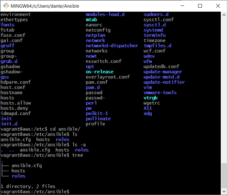
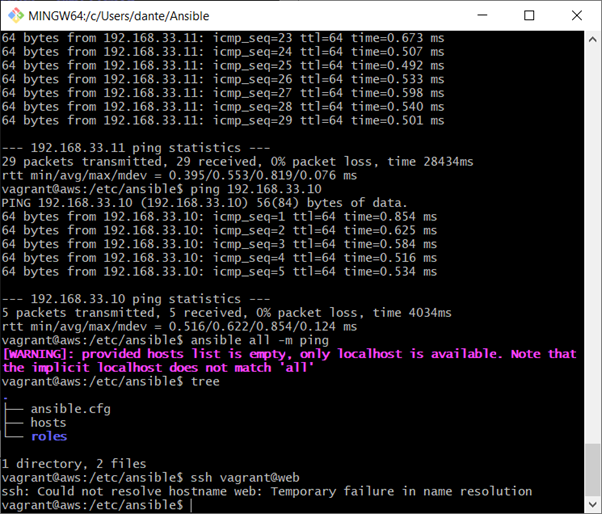
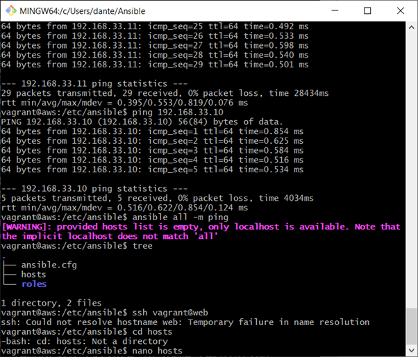
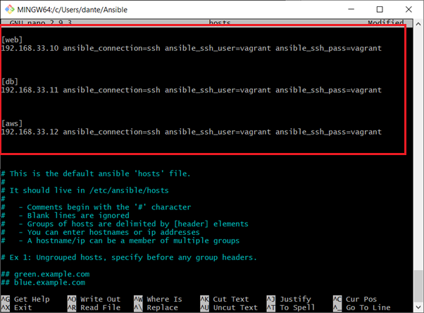
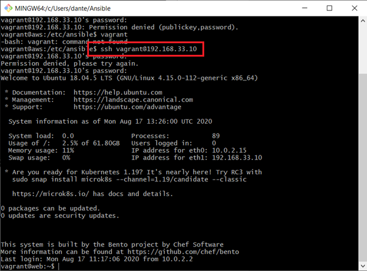
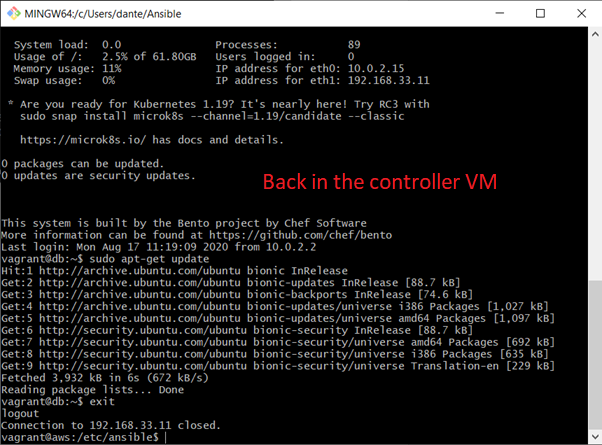
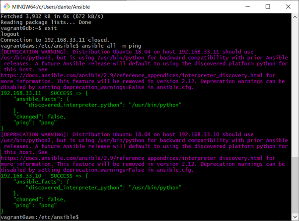

# Ansible

Infrastructure as code – IAC

### Why should we use it?
To help speed up the process of the configuration management Ansible or orchestration. – Terraform
### How does it speed up the process?
By creating a script whether in YML file using ansible. YMAL = Another mark-up language
We can create a ansible VM/Controller and it will provision both the web and DB instances.
###What is ansible?
Automation tool for configuration management tool
- Simple
- Agentless
- IT automation tools – One of the most trending configuration management tools
- Connects using SSH – Any server in the world

### How does it fit into DevOps?
- Saves time
- Open source
- Makes configuration management predictable
- Cost effective
- It automates the process of configuration management 

When you are given a task on ansible, the first point of call should be the official documentation.
Docs.ansible.com


# Ansible step by step

##### 1) First create a dircectory called ansible


##### 2) Create a new file inside the Ansible Dirc using Nano vagrantfile


##### 3) Paste the code provided inside the vagrant file. This code will create 3 VMs. One app, one DB and one AWS.


##### 4) Once the vagrant file is pasted then use the command vagrant up and wait for the VMs to boot up


##### 5) Type the command vagrant status to see the status of your virtual machines. As you can see all VMS are now up and running


##### 6) Now I SSH into the web VM using the command 
``` vagrant ssh web ```


##### 7) Use the command ```sudo apt-get update``` command inside the web to update files


##### 8) I then used the same commands on the DB and AWS Virtual machines. SSh into the VM and use ```sudo apt-get update``` Once updated I then used exit to enter back into the OS. I now have updated all 3 VMS and they are all running


# Creating the controller

##### 1) SSH into the VM you would like to use as the controller. I will be using the AWS VM. So I used the command ```vagrant ssh aws```. Once inside the controller or the aws VM in my case install the following 
```python
sudo apt-get update
```
```python
sudo apt-get install software-properties-common -y
```
```python
sudo apt-add-repository --yes --update ppa:ansible/ansible
```
```python
sudo apt-get install ansible
```
```python
sudo apt-get install tree
```

##### 2) Once everything is installed we can go into the etc folder which is where ansible is installed. Once inside ansible I used tree command to display the files in a aesthetically pleasing manner.



##### 3) ```Ansible VM/IP -m ping``` is used to ping any VM you use. To ping all VMS use all. When trying to ssh into the web VM. It presents an error as we have not set the local hosts/IP adresses



##### 4) To solve this go into the hosts file using ```sudo nano hosts```



##### 5) Once inside I pasted the code:
```
[web]
192.168.33.10 ansible_connection=ssh ansible_ssh_user=vagrant ansible_ssh_pass=vagrant
 
[db]
192.168.33.11 ansible_connection=ssh ansible_ssh_user=vagrant ansible_ssh_pass=vagrant
 
[aws]
192.168.33.12 ansible_connection=ssh ansible_ssh_user=vagrant ansible_ssh_pass=vagrant
```

You must change the IP address of each respective VM. This can be found in the vagrantfile



##### 6) I then SSH into the app using the IP address ```ssh vagrant@192.168.33.10``` If asked for a password type in vagrant. We are now inside the app VM. Note that i SSH into the app VM from the CONTROLER/aws VM



##### 7) I then used the command ```sudo apt-get update``` to install any updates. I also done this on the DB VM.I then exited the VM so I am back inside the controller VM



##### 8) Now in the controller when I enter the command ```ansible all -m ping``` I am presented with the following. This shows everything is working.




