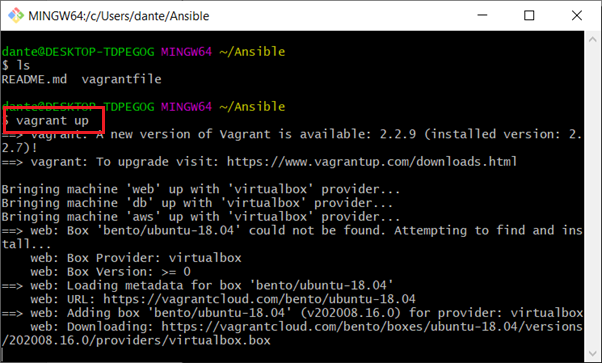

# Ansible

Infrastructure as code – IAC

### Why we use it?
To help speed up the process of the configuration management Ansible or orchestration. – Terraform
### How does it speed up the process?
By creating a script whether in YML file using ansible. YMAL = Another mark-up language
We can create a ansible VM/Controller and it will provision both the web and DB instances.
###What is ansible?
Automation tool for configuration management tool
- Simple
- Agentless
- IT automation tools – One of the most trending configuration management tools
- Connects using SSH – Any server in the world

### How does it fit into DevOps?
- Saves time
- Open source
- Makes configuration management predictable
- Cost effective
- It automates the process of configuration management 

When you are given a task on ansible, the first point of call should be the official documentation.
Docs.ansible.com


# Ansible step by step

##### 1) First create a dircectory called ansible


##### 2) Create a new file inside the Ansible Dirc using Nano vagrantfile


##### 3) Paste the code provided inside the vagrant file. This code will create 3 VMs. One app, one DB and one AWS.


##### 4) Once the vagrant file is pasted then use the command vagrant up and wait for the VMs to boot up



##### 5) Type the command vagrant status to see the status of your virtual machines. As you can see all VMS are now up and running


##### 6) Now I SSH into the web VM using the command 
``` vagrant ssh web ```


##### 7) Use the command ```sudo apt-get update``` command inside the web to update files


##### 8) I then used the same commands on the DB and AWS Virtual machines. SSh into the VM and use ```sudo apt-get update``` Once updated I then used exit to enter back into the OS. I now have updated all 3 VMS and they are all running

